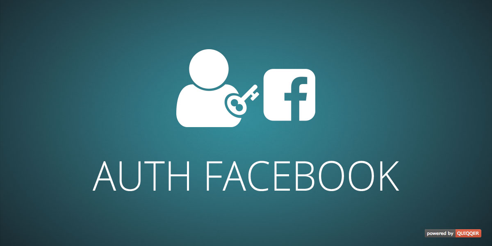

QUIQQER Facebook authentication and registration
========

This module provides a registrar (registration option) for the `quiqqer/frontend-users` module. Users can sign up using their Facebook account.

This module further provides an authentication for QUIQQER. Users can sign in using their Facebook account.

Package Name:

    quiqqer/authfacebook

Features
--------
* Registration via Facebook account (requires `quiqqer/frontend-users`)
* Authentication via Facebook account

Installation
------------
The Package Name is: quiqqer/authfacebook

Contribute
----------
- Project: https://dev.quiqqer.com/quiqqer/authfacebook
- Issue Tracker: https://dev.quiqqer.com/quiqqer/authfacebook/issues
- Source Code: https://dev.quiqqer.com/quiqqer/authfacebook/tree/master

Support
-------
If you have found errors, wishes or suggestions for improvement,
you can contact us by email at support@pcsg.de.

We will transfer your message to the responsible developers.

License
-------
GPL-3.0+