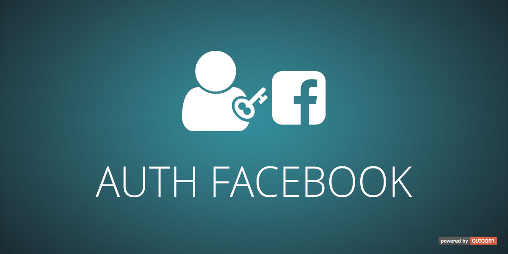

# Facebook authentication for QUIQQER

`quiqqer/authfacebook` adds Facebook Login to QUIQQER. It provides both a primary authenticator and a registration option for `quiqqer/frontend-users`.

## Requirements

- PHP 8.2 or newer
- QUIQQER Core 2.24 or newer
- `quiqqer/frontend-users` 2.8 or newer
- A Meta developer application with Facebook Login configured

The optional `quiqqer/gdpr` package can consume the included Facebook cookie metadata for consent management.

## Installation

Install the package through the QUIQQER package manager or with Composer:

```bash
composer require quiqqer/authfacebook
```

Run the QUIQQER setup after installation so the package database table, settings, events, and providers are registered.

## Configuration

Create a web application in the Meta Developer dashboard and enable Facebook Login. Add the website domain and its HTTPS URL to the application settings.

Open the frontend-users settings in the QUIQQER administration and select the Facebook authentication section. Enter:

- App ID
- App Secret
- Graph API version

The browser integration uses the Facebook JavaScript SDK. Ensure the website origin is allowed by the Meta application and that the application is live for production users.

## Usage

After configuration, the Facebook button is available in the QUIQQER login and frontend registration flows. A successful registration links the Facebook user identifier to the created QUIQQER user.

## Development

Initialize and run the package-local quality tools with:

```bash
composer dev:init
composer test
```

The test command runs PSR-12 checks, PHPStan level 8, and PHPUnit. PHPStan uses analysis-only stubs when the optional GDPR package is not installed.

## Support

- Issues: https://dev.quiqqer.com/quiqqer/authfacebook/issues
- Source: https://dev.quiqqer.com/quiqqer/authfacebook
- Email: support@pcsg.de

## License

GPL-3.0-or-later
